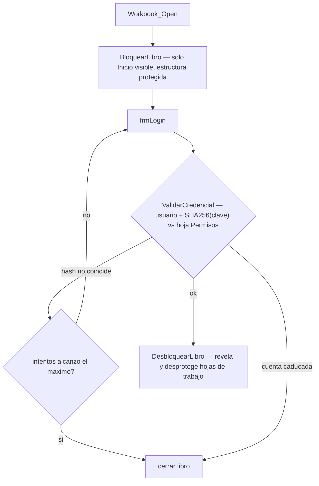

# Excel Access Control (VBA)


Módulo de **control de acceso para libros de Excel**: el archivo se abre
"cerrado" (solo se ve una hoja de bienvenida; el resto está *muy oculto* y la
estructura del libro protegida). El usuario debe autenticarse en un formulario;
si la credencial es válida y no ha caducado, se revelan las hojas de trabajo.

Nació de un encargo real ("herramientas de automatización en Excel con inicio de
sesión y seguridad para proteger los datos"). Este repositorio es una versión
**limpia y anonimizada**: sin datos del cliente, sin contraseñas reales y con el
hash de contraseñas reescrito como un **SHA-256 en VBA puro**.

## Flujo



## Qué demuestra este proyecto

- Diseño de un flujo de autenticación completo en VBA: bloqueo/desbloqueo de
  hojas (`xlSheetVeryHidden`), protección de estructura del libro, límite de
  intentos, caducidad de cuentas por fecha, cierre automático del archivo.
- **SHA-256 implementado desde cero en VBA** (`modCrypto.bas`), con aritmética
  de 32 bits sin signo emulada para funcionar en Office de 32 y 64 bits, más un
  módulo de pruebas con los vectores estándar de FIPS 180-4.
- Las contraseñas de los usuarios **nunca se guardan en claro**: en la hoja solo
  vive su hash.
- Separación limpia: la lógica (`modAuth`) está aislada del formulario
  (`frmLogin`), que solo maneja la interacción.

## Archivos

| Archivo | Contenido |
|---|---|
| `src/modCrypto.bas` | SHA-256 en VBA puro (`SHA256("abc") -> ba7816bf…`) |
| `src/modCrypto_Tests.bas` | Vectores de prueba estándar — ejecutar antes de confiar en el hash |
| `src/modAuth.bas` | Bloqueo/desbloqueo del libro, validación de credenciales, alta de usuarios |
| `src/frmLogin.frm` | Código del formulario de inicio de sesión |
| `src/ThisWorkbook.cls` | Enganches `Workbook_Open` / `Workbook_BeforeClose` |

## Instalación en un libro

1. Abrir el editor de VBA (`Alt+F11`):
   - Importar `modCrypto.bas`, `modCrypto_Tests.bas` y `modAuth.bas`
     (*File → Import File*).
   - Pegar el contenido de `ThisWorkbook.cls` en el módulo **ThisWorkbook**.
   - Crear un **UserForm** llamado `frmLogin` con los controles que indica el
     encabezado de `frmLogin.frm` (`txtUsuario`, `txtContrasena`, `cmdAceptar`,
     `lblIntentos`) y pegar en su módulo de código el cuerpo de ese archivo
     (todo lo que va después de la sección `Attribute`).
2. Crear una hoja **`Inicio`** (bienvenida) y una hoja **`Permisos`** con esta
   estructura, a partir de la fila 2:

   | A (usuario) | B (caducidad) | C (hash SHA-256 de la clave) |
   |---|---|---|
   | ana | 2027-01-31 | `9f86d0818884...` |

3. Generar los hashes desde la ventana Inmediato:

   ```vba
   modAuth.EstablecerUsuario "ana", "claveSegura", DateSerial(2027, 1, 31)
   ```

4. Cambiar las constantes `PWD_*` de `modAuth.bas` por contraseñas propias.
5. Guardar como `.xlsm` y volver a abrir.

## Limitaciones (conocidas)

La protección de hojas y de VBA en Excel **no es un mecanismo de seguridad
fuerte** — es una barrera contra usuarios no técnicos, no contra un atacante
decidido. Para datos verdaderamente sensibles, la información debe vivir en un
sistema con control de acceso real, no en un archivo de Excel.

## Licencia

[MIT](./LICENSE)
